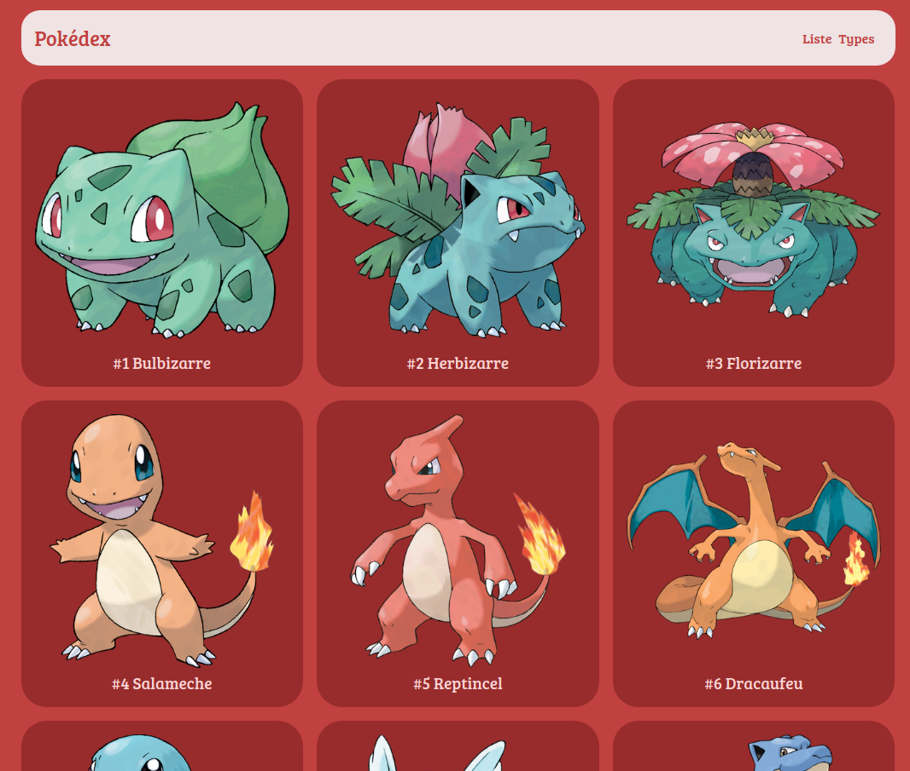

# Challenge Pokedex

Ce projet est un challenge que j'ai effectué pendant ma [formation O'Clock](https://oclock.io/formations/developpeur-web-fullstack-javascript), durant la quatrième "saison".\
Il s'agissait de créer un dictionnaire de tous les pokémon, avec **EJS**, **Express.js** et **PostgreSQL**, en suivant le visuel donné.



## Technologies

- HTML
- CSS
- EJS
- Node.js
- Express.js
- PostgreSQL

## Installation

```
git clone https://github.com/Nina-petit/Formation-Pokedex.git
cd Formation-Pokedex
npm install
```
- Base de données:
    - Créer une base de données
    - La remplir avec pokedex.sql
    - Ajouter son URL dans un .env en suivant le .env.example.
- Lancer le projet: `node index.js`
- Ouvrir le projet sur localhost:5001

## Fonctionnalités

- Voir la liste de tous les pokémons
- Voir la liste de tous les types de pokémons
- Voir tous les pokémons d'un certain type
- Voir le détail d'un Pokémon